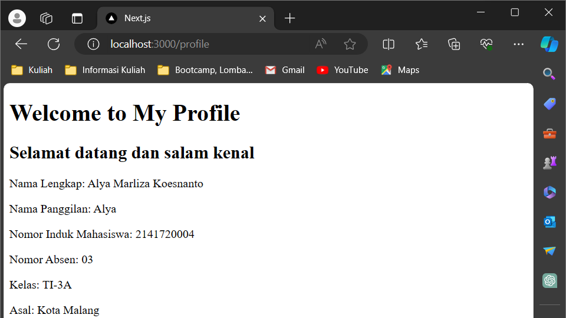

This is a [Next.js](https://nextjs.org/) project bootstrapped with [`create-next-app`](https://github.com/vercel/next.js/tree/canary/packages/create-next-app).

## Getting Started

First, run the development server:

```bash
npm run dev
# or
yarn dev
# or
pnpm dev
# or
bun dev
```

Open [http://localhost:3000](http://localhost:3000) with your browser to see the result.

You can start editing the page by modifying `app/page.tsx`. The page auto-updates as you edit the file.

This project uses [`next/font`](https://nextjs.org/docs/basic-features/font-optimization) to automatically optimize and load Inter, a custom Google Font.

# **Laporan Praktikum**

|  | Pemrograman Berbasis Framework 2024 |
|--|--|
| NIM | 2141720004 |
| Nama | Alya Marliza Koesnanto |
| Kelas | TI - 3A |
| | |

* ## **Jawaban Soal/Praktikum 1**

>**Home**


>**/About**


>**/Profile**


* ## **Jawaban Soal/Praktikum 2**

>**/Blogs**


>**/Blogs/first**


>**/Blogs/second**


>**Pertanyaan:** Apa kekurangan yang mungkin terjadi jika menggunakan pendekatan pada Praktikum 2 untuk menangani routing?

>**Jawaban:** Kekurangan yang terjadi dalam menggunakan routing bersarang ialah kompleksitas kode yang kompleks, kesulitan dalam pemeliharaan karena banyaknya lapisan routing, penanganan _error_ yang jauh lebih rumit, serta penanganan navigasi antar halaman yang bersarang cukup tumit dan membingungkan bagi pengguna.

* ## **Jawaban Soal/Praktikum 3**

> **Hasil ToDo 1**


> **Hasil ToDo 2**


* ## **Jawaban Soal/Praktikum 4**

